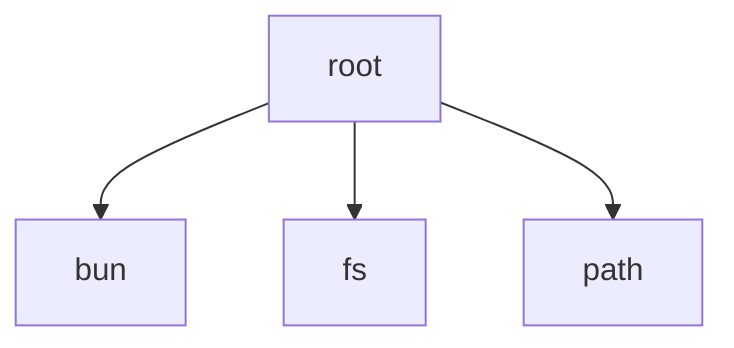

# Root Module

[← Back to INDEX](../../INDEX.md)

**Type:** root | **Files:** 7

## Files

| File | Lines | Large |
| ---- | ----- | ----- |
| `Quotio/QuotioApp.swift` | 527 | 📊 |
| `Quotio/Services/Tunnel/CloudflaredService.swift` | 266 |  |
| `Quotio/Services/Tunnel/TunnelManager.swift` | 183 |  |
| `Quotio/ViewModels/AgentSetupViewModel.swift` | 499 |  |
| `Quotio/ViewModels/LogsViewModel.swift` | 82 |  |
| `Quotio/ViewModels/QuotaViewModel.swift` | 1807 | 📊 |
| `scripts/capture-screenshots.ts` | 763 | 📊 |

## Documentation

- [outline.md](outline.md) - Symbol maps for large files
- [memory.md](memory.md) - Warnings and TODOs

---

## External Dependencies

Dependencies from other modules:

- `bun`
- `fs`
- `path`
